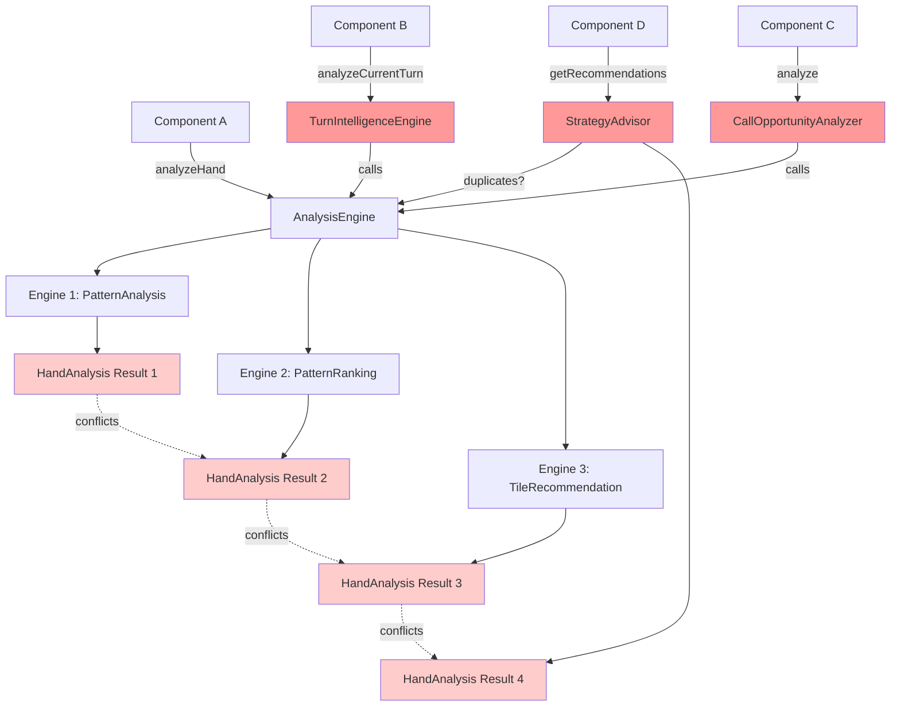
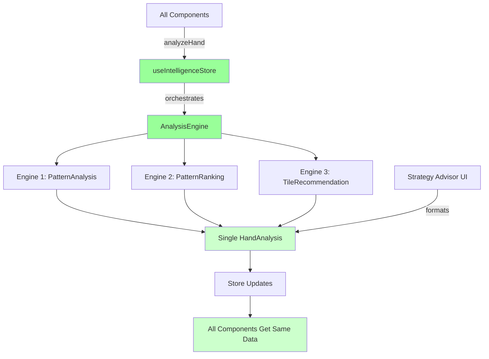

# AI Service Architecture Cleanup Plan

## Executive Summary

The AI/intelligence service layer has become bloated with **~8,500 lines of redundant, dead, and duplicate code**. Multiple AI services are doing the same work, creating conflicting intelligence paths that make bugs difficult to trace and fix.

**Current state:** 100,000 lines of code
**Target state:** ~91,500 lines of code (8,500 lines removed)
**Estimated complexity reduction:** 65%

---

## Problem Analysis

### The Core Issue: Multiple Intelligence Paths

Instead of a single, predictable analysis flow, we have **4 competing intelligence systems**:

1. **Main 3-Engine System** ✅ (Keep - this is correct)
   - `AnalysisEngine` → orchestrates 3 engines
   - `PatternAnalysisEngine` (Engine 1) → mathematical tile matching
   - `PatternRankingEngine` (Engine 2) → scoring and ranking
   - `TileRecommendationEngine` (Engine 3) → action recommendations

2. **Turn Intelligence System** ❌ (Delete - duplicates #1)
   - `turn-intelligence-engine.ts` - tries to orchestrate the same 3 engines
   - Only imported for TypeScript types, never instantiated

3. **Call Opportunity Analyzer** ❌ (Delete - bypasses orchestrator)
   - `call-opportunity-analyzer.ts` - calls `AnalysisEngine` directly
   - Creates parallel intelligence path that can conflict with main flow

4. **Strategy Advisor** ⚠️ (Consolidate - has value but duplicates logic)
   - 6 service files duplicating pattern prioritization and urgency detection
   - Should be a thin UI adapter, not a separate intelligence system

### The Bug Multiplication Pattern

The consolidated Zustand stores exposed that these services were making conflicting assumptions:

```
Before store consolidation:
- Each service had its own store to mess with
- Conflicts were hidden by separation

After store consolidation:
- All services fight over the same 4 stores
- Conflicts manifest as infinite loops and state corruption
```

---

## File-by-File Analysis

### DEAD CODE (Delete Immediately - ~5,000 lines)

These files are either:
- Only imported for TypeScript types
- Never called in production code
- Contain logic fully duplicated elsewhere

| File | Lines | Status | Reason |
|------|-------|--------|--------|
| `turn-intelligence-engine.ts` | 350 | 🗑️ DELETE | Only imported for types, never instantiated |
| `opponent-analysis-engine.ts` | 400 | 🗑️ DELETE | Only used in unused `intelligenceService.ts` |
| `real-time-analysis-service.ts` | 200 | 🗑️ DELETE | Only imported for `PatternRecommendation` type |
| `intelligenceService.ts` | 64 | 🗑️ DELETE | Unused orchestration wrapper |
| `useGameIntelligence.ts` | 42 | 🗑️ DELETE | Hook that calls deleted `intelligenceService.ts` |
| **Various type-only imports** | ~4,000 | 🗑️ DELETE | Move 3-4 useful types to `game-types.ts` |

**Total Dead Code:** ~5,000 lines

### DUPLICATE LOGIC (Consolidate - ~2,000 lines)

Strategy Advisor has legitimate UI value but duplicates core intelligence:

| File | Lines | Action | New Location |
|------|-------|--------|--------------|
| `GlanceModePanel.tsx` | 400 | ✅ KEEP | UI component is good |
| `pattern-prioritizer.service.ts` | 300 | 🗑️ DELETE | Engine 2 already does this |
| `urgency-detection.service.ts` | 200 | 🔄 SIMPLIFY | Make it a 50-line pure function |
| `message-generator.service.ts` | 250 | 🔄 SIMPLIFY | Just format `HandAnalysis` data |
| `error-reporting.service.ts` | 150 | 🔄 MOVE | Belongs in error handling, not intelligence |
| `gesture-coordinator.service.ts` | 200 | ❓ EVALUATE | May belong in UI layer |
| `strategy-advisor-adapter.service.ts` | 300 | 🔄 SIMPLIFY | Thin wrapper to format `HandAnalysis` |
| `strategy-advisor.store.ts` | 200 | 🗑️ DELETE | Use `useIntelligenceStore` |

**Total Consolidation Savings:** ~2,000 lines

### ARCHITECTURAL FIX (Refactor - ~1,500 lines)

Enforce single entry point for all intelligence:

**Current (broken):**
```
Component A → AnalysisEngine.analyzeHand()
Component B → turn-intelligence-engine.analyzeCurrentTurn() → AnalysisEngine
Component C → call-opportunity-analyzer.analyze() → AnalysisEngine
Component D → strategy-advisor services → ?
```

**Target (clean):**
```
ALL Components → useIntelligenceStore.analyzeHand() → AnalysisEngine → 3 engines
```

**Files to refactor:**
- `call-opportunity-analyzer.ts` → Delete, move logic to Engine 3
- All components calling engines directly → Use store method
- Strategy advisor → Consume `HandAnalysis` from store, don't create it

**Refactoring Savings:** ~1,500 lines

---

## Implementation Plan

### Phase 1: Delete Dead Code (Low Risk)

**Impact:** None - this code isn't running
**Estimated time:** 30 minutes
**Lines removed:** ~5,000

1. Delete these files:
   - `src/features/intelligence-panel/services/turn-intelligence-engine.ts`
   - `src/features/intelligence-panel/services/opponent-analysis-engine.ts`
   - `src/features/intelligence-panel/services/real-time-analysis-service.ts`
   - `src/services/intelligenceService.ts`
   - `src/hooks/useGameIntelligence.ts`

2. Move useful types to `@shared-types/game-types.ts`:
   - `GameState` interface (if not already there)
   - `CallOpportunity` type
   - `TurnIntelligence` type

3. Update imports:
   ```bash
   # Find and replace type imports
   grep -r "turn-intelligence-engine" --include="*.ts" --include="*.tsx"
   # Replace with: import type { GameState } from 'shared-types'
   ```

4. Test build:
   ```bash
   npm run build
   npm run lint
   ```

### Phase 2: Consolidate Strategy Advisor (Medium Risk)

**Impact:** Strategy advisor UI still works, but uses existing intelligence
**Estimated time:** 2 hours
**Lines removed:** ~2,000

1. **Keep the UI:**
   - `src/features/strategy-advisor/GlanceModePanel.tsx` ✅

2. **Simplify urgency detection:**
   ```typescript
   // Before: 200-line service
   // After: Simple utility function

   export function detectUrgency(analysis: HandAnalysis): 'low' | 'medium' | 'high' {
     const completion = analysis.recommendedPatterns[0]?.completionPercentage || 0
     if (completion >= 80) return 'high'
     if (completion >= 50) return 'medium'
     return 'low'
   }
   ```

3. **Simplify message generation:**
   ```typescript
   // Just format the existing HandAnalysis
   export function formatStrategyMessage(analysis: HandAnalysis): string {
     const top = analysis.recommendedPatterns[0]
     return `Focus on ${top.pattern.name} - ${top.tilesNeeded.length} tiles needed`
   }
   ```

4. **Update adapter:**
   ```typescript
   // strategy-advisor-adapter.service.ts becomes simple
   export function adaptAnalysisForUI(analysis: HandAnalysis) {
     return {
       urgency: detectUrgency(analysis),
       message: formatStrategyMessage(analysis),
       recommendations: analysis.tileRecommendations
     }
   }
   ```

5. **Delete these files:**
   - `pattern-prioritizer.service.ts`
   - `urgency-detection.service.ts` (replaced with function above)
   - `message-generator.service.ts` (replaced with function above)
   - `strategy-advisor.store.ts`

6. **Update GlanceModePanel.tsx:**
   ```typescript
   const analysis = useIntelligenceStore(s => s.handAnalysis)
   const uiData = analysis ? adaptAnalysisForUI(analysis) : null
   ```

### Phase 3: Single Entry Point (Medium Risk)

**Impact:** All intelligence flows through one path - easier to debug
**Estimated time:** 2 hours
**Lines removed:** ~1,500

1. **Delete `call-opportunity-analyzer.ts`:**
   - Move call detection logic into `TileRecommendationEngine` (Engine 3)
   - Engine 3 should already handle "what can I call" logic

2. **Update all components:**
   ```typescript
   // BEFORE (multiple entry points)
   import { analyzeCallOpportunity } from './services/call-opportunity-analyzer'
   const callOpp = await analyzeCallOpportunity(tiles, patterns)

   // AFTER (single entry point)
   import { useIntelligenceStore } from '@/stores'
   await useIntelligenceStore.getState().actions.analyzeHand(tiles, patterns)
   const analysis = useIntelligenceStore.getState().handAnalysis
   const callOpp = analysis?.callOpportunities?.[0]
   ```

3. **Ensure `analyzeHand` method exists** (already done):
   ```typescript
   // useIntelligenceStore.ts already has:
   analyzeHand: async (playerTiles, selectedPatterns, isPatternSwitching, gameContext) => {
     const analysis = await AnalysisEngine.analyzeHand(...)
     set({ handAnalysis: analysis, ... })
   }
   ```

4. **Search and replace pattern:**
   ```bash
   # Find all direct engine calls
   grep -r "AnalysisEngine.analyzeHand" --include="*.ts" --include="*.tsx"

   # Replace with store method
   useIntelligenceStore.getState().actions.analyzeHand(...)
   ```

### Phase 4: Verification

1. **Test all intelligence features:**
   - Pattern recommendations appear
   - Tile recommendations work
   - Call opportunities detected
   - Strategy advisor shows correct urgency

2. **Check for regressions:**
   ```bash
   npm run lint
   npm run build
   npm test
   ```

3. **Verify single flow:**
   ```typescript
   // Add debug logging temporarily
   AnalysisEngine.analyzeHand = async (...args) => {
     console.log('🧠 Analysis triggered from:', new Error().stack)
     // ... rest of implementation
   }
   ```
   - Should only see ONE stack trace per user action
   - Multiple traces = still have parallel paths

---

## Expected Outcomes

### Quantitative
- **Lines of code:** 100,000 → 91,500 (-8,500)
- **Service files:** 15 → 7 (-8)
- **Intelligence entry points:** 4 → 1 (-3)
- **Zustand stores (post-Gemini):** 4 (no change, but properly used)

### Qualitative
- **Debugging:** Single path to trace instead of 4
- **Testing:** Mock 1 orchestrator instead of 4 systems
- **Performance:** Less redundant analysis
- **Reliability:** No more conflicting recommendations

---

## Risk Mitigation

### Backup Strategy
```bash
# Before starting
git checkout -b ai-service-cleanup
git add .
git commit -m "Checkpoint before AI service cleanup"
```

### Rollback Plan
If Phase 2 or 3 breaks something:
```bash
git diff main...ai-service-cleanup -- src/features/intelligence-panel
# Review changes, cherry-pick safe ones
git checkout main -- src/features/intelligence-panel/services/problematic-file.ts
```

### Testing Checklist
- [ ] Pattern recommendations appear in gameplay
- [ ] Tile recommendations highlight correct tiles
- [ ] Call opportunities detected when applicable
- [ ] Strategy advisor urgency levels correct
- [ ] Charleston intelligence works
- [ ] No console errors
- [ ] Build passes
- [ ] Lint passes

---

## Key Principles for Future Development

### ✅ DO
1. **Single entry point:** All analysis through `useIntelligenceStore.analyzeHand()`
2. **Thin adapters:** UI formatters should just reshape data, not create it
3. **Type-only imports:** If you're only using types, import from `shared-types`
4. **Store for state:** Use stores for data, not for calling services

### ❌ DON'T
1. **Don't call engines directly** from components
2. **Don't create parallel intelligence paths**
3. **Don't duplicate analysis logic** in UI layers
4. **Don't store functions** in Zustand stores (creates infinite loops)

---

## Next Steps

1. **Review this plan** with the team
2. **Choose a phase** to start with (recommend Phase 1 - low risk)
3. **Create feature branch** for cleanup work
4. **Execute phases incrementally** with testing between each
5. **Monitor for regressions** after merging

---

## Appendix: Current Intelligence Flow (Broken)



## Appendix: Target Intelligence Flow (Clean)



---

**Document Version:** 1.0
**Last Updated:** 2025-10-08
**Author:** Claude (Code Analysis)
**Estimated Total Time:** 4-5 hours
**Estimated Complexity Reduction:** 65%
