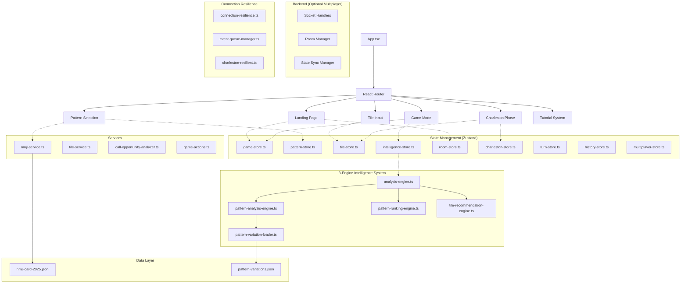
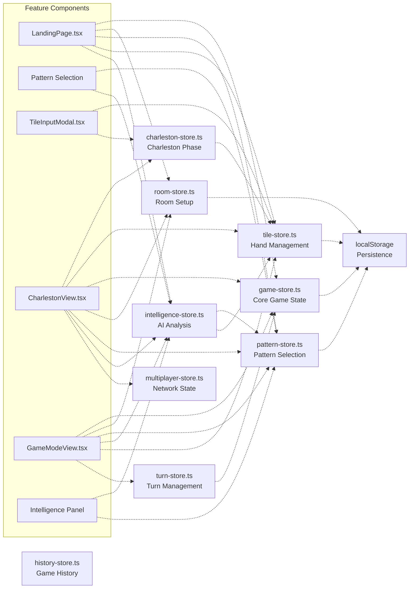
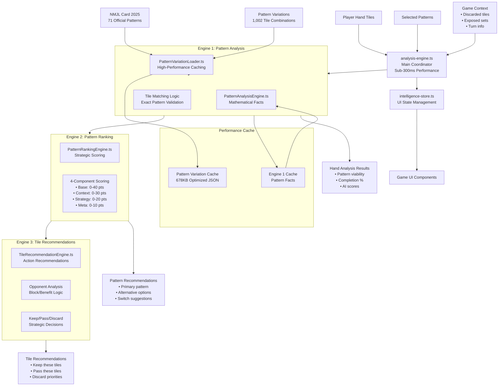
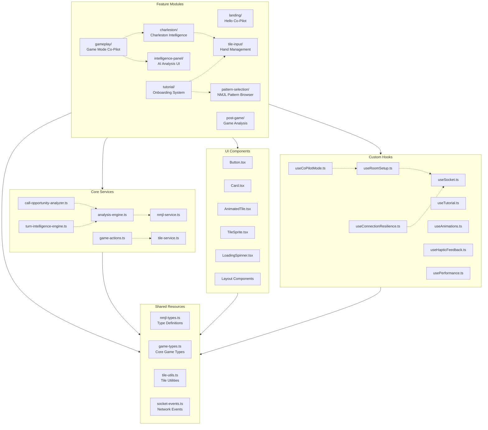
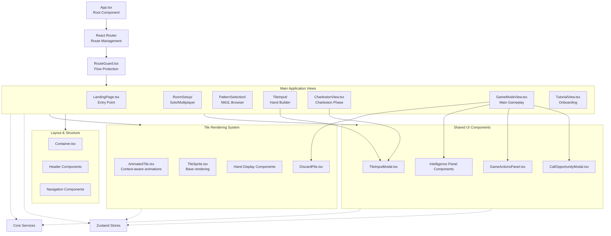

# American Mahjong Assistant - Architecture Visualizations

*Generated on: January 9, 2025*

This file contains Mermaid diagrams showing the architectural relationships in your American Mahjong Assistant codebase. You can view these diagrams by:

- **GitHub**: View this file directly on GitHub (renders automatically)
- **VS Code**: Install "Mermaid Preview" extension and open preview
- **Online**: Copy/paste code blocks into [mermaid.live](https://mermaid.live)

---

## 1. Architecture Overview - High-Level System Flow

---

## 2. Store Network - Zustand State Management

---

## 3. 3-Engine Intelligence System Flow

---

## 4. Feature Dependencies Map

---

## 5. Component Hierarchy & Data Flow

---

## Key Architectural Insights

### **1. Co-Pilot Pattern**
- **Central Intelligence Hub**: `intelligence-store.ts` coordinates AI analysis across all features
- **User Agency**: AI provides suggestions, users make all decisions
- **Real-time Updates**: Analysis triggers on every tile transaction

### **2. State Management Strategy**
- **Feature-based Stores**: Each major feature has dedicated Zustand store
- **Cross-store Dependencies**: Stores coordinate through selectors and actions
- **Persistence**: Critical state persisted to localStorage with rehydration

### **3. 3-Engine Intelligence System**
- **Pipeline Architecture**: Facts → Ranking → Recommendations
- **Performance Optimized**: Sub-300ms analysis with intelligent caching
- **Real Data Integration**: 1,002 pattern variations for exact matching

### **4. Component Architecture**
- **Feature Folders**: Complete feature isolation with co-located components/stores
- **Shared UI Library**: Reusable components with consistent design system
- **Route Protection**: RouteGuard ensures proper game flow progression

### **5. Connection Resilience**
- **Event Queuing**: Operations queued during disconnection, replayed on reconnect
- **Service Coordination**: Unified multiplayer service manager
- **Graceful Degradation**: Solo mode works offline, multiplayer handles network issues

---

## How to View These Diagrams

### **GitHub/GitLab** ✅
- View this file directly in your repository
- Mermaid renders automatically in markdown files

### **VS Code** ✅
1. Install "Mermaid Preview" extension
2. Open this file in VS Code
3. Right-click → "Open Preview" or use Ctrl+Shift+V

### **Online Viewers** ✅
- [Mermaid Live Editor](https://mermaid.live) - Copy/paste any diagram
- [GitHub Gist](https://gist.github.com) - Create a `.md` gist

### **Documentation Sites** ✅
- GitBook, Notion, Obsidian all support Mermaid
- Most modern markdown processors include Mermaid support

---

*These diagrams show how the American Mahjong Assistant follows a modern, scalable architecture with clear separation of concerns, intelligent caching, and robust error handling - all designed to provide a seamless co-pilot experience for in-person mahjong games.*